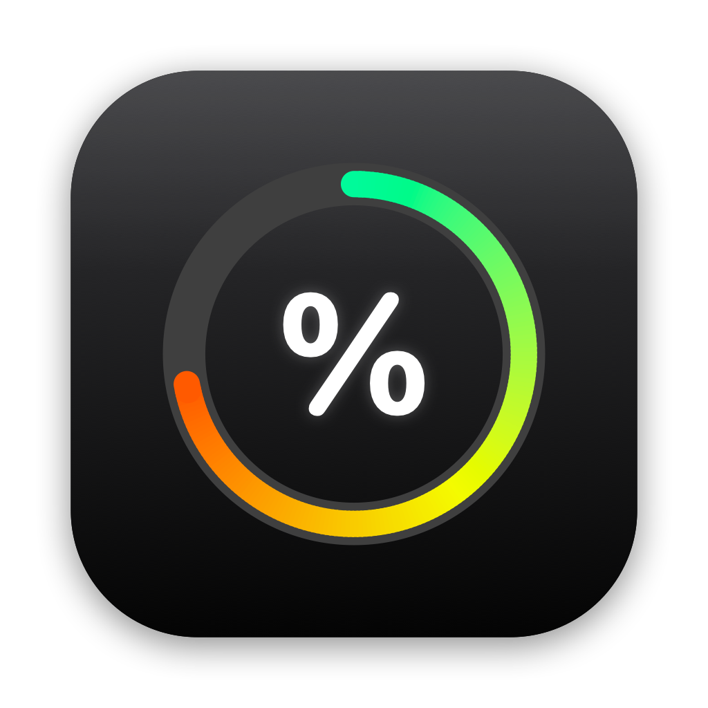
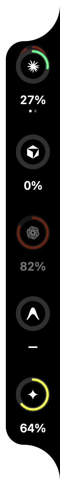
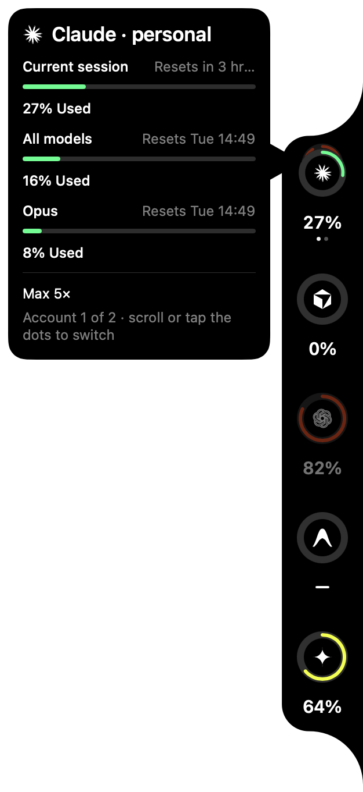
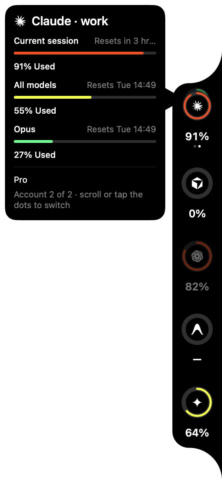
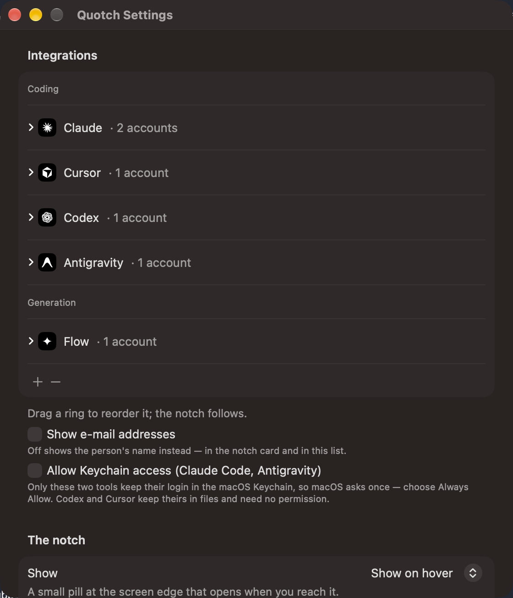

<p align="center"></p>
<h1 align="center">Quotch</h1>
<p align="center">Your AI quotas, living in the notch. Several accounts per provider, stacked like cards.<br>macOS only · Swift · no Xcode required</p>

<p align="center"></p>

## What it does
A thin black strip hugs the edge of your screen. Hover it and it opens into rings — one per AI provider — with the
percentage of your quota used. **Providers with more than one account show as a stack of cards**: scroll over the
ring (or tap the dots) to bring the next account to the front. Hover a ring for the full breakdown: every quota
window, when it resets, who the account belongs to.

| Collapsed | Expanded | Hover card | Stack flipped | Settings button |
|---|---|---|---|---|
|  |  |  |  |  |

## Providers
| | Reads | How |
|---|---|---|
| **Claude** (Claude Code) | session + weekly windows | Keychain login → `api.anthropic.com/api/oauth/usage` (opt-in toggle) |
| **Codex** (ChatGPT) | weekly limit | local rollout files — no network |
| **Cursor** | included usage, on-demand | `state.vscdb` session → `cursor.com/api/usage-summary` |
| **Antigravity** | — | identity only for now |
| **Google Flow** | credits (generation) | planned |

Quotch never asks for a password. It reads logins the tools already keep on your Mac, and shows the account's
name, e-mail (can be hidden) and plan so you always know which account a ring is.

## Design
A notch strip rebuilt from careful measurement (two-arc silhouette, 44 pt rings, 102.5 pt rhythm, tuned springs), then extended with:
account stacks, identity, a round settings button that emerges from the tip on hover, click-to-refresh.
Everything is clipped to the silhouette, so nothing ever bleeds past the black.

<p align="center"></p>

## Build & run
```bash
bash build.sh          # swiftc → /Applications/Quotch.app
open -g -a Quotch      # lives outside the Dock; appears in the Dock only while Settings is open
```
Right-click the strip for the menu (Keep open · Refresh now · Settings… · Open <site> · Quit).

## Docs
`docs/HANDOFF.md` (start here) · `docs/TASKS.md` (what's done / next) · `docs/spec.md` · `docs/design-tokens.md` · `docs/backlog.md`.


## Reading accounts from your browser

Quotch can read a provider straight from the browser where you are already signed in — no login inside the app, no Full Disk Access. It opens the site in a tab of that browser/profile, reads the numbers through the page, and closes the tab.

- **Chrome** (any profile): turn on *View › Developer › Allow JavaScript from Apple Events* once (Quotch also writes the preference; it applies the next time Chrome starts).
- **Safari**: *Develop › Allow JavaScript from Apple Events*.
- macOS asks once for Automation permission ("Quotch wants to control Safari/Chrome") — choose Allow.

Sources that read directly from the desktop tools need no browser: Claude Code, Codex CLI, Cursor app, Antigravity.

## Credits
Designed and developed by [matheusbgodoi](https://www.linkedin.com/in/matheusgodoi-engbio/). Provider marks belong to their owners.
